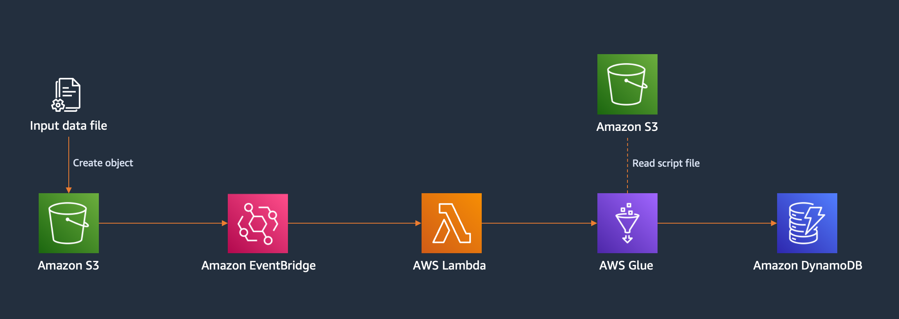

## Disclaimer
This solution is for demonstration purposes only and is not production-ready.

THIS SOLUTION IS PROVIDED "AS IS", WITHOUT WARRANTY OF ANY KIND.


# Why?
To import data from Amazon S3 to Amazon DynamoDB, you can use the DynamoDB data import feature [[announcement](https://docs.aws.amazon.com/amazondynamodb/latest/developerguide/S3DataImport.HowItWorks.html)] [[blog post](https://aws.amazon.com/blogs/database/amazon-dynamodb-can-now-import-amazon-s3-data-into-a-new-table/)] .

At the time of this writing, the import function does not support importing to an existing DynamoDB table, so a custom solution is needed.

# What?

This solution deploys a pipeline that imports data from S3 into DynamoDB using a serverless low-code solution.



# How?

## Prerequisites
The solution declares a depandency on Terraform 1.3.5 and Terraform AWS provider 4.41. It might work on the earlier releases, but it has been tested on these versions only.

## Configure AWS CLI
Follow the steps in the [AWS CLI guide](https://docs.aws.amazon.com/cli/latest/userguide/cli-chap-configure.html) to configure the AWS CLI credentials, profile, and set the region you want to deploy the solution to.

## Configure Terraform variables
The solution defines Terraform variables in `vars.tf`. All resources created by the solution use a prefix with a default value. Modify the resource name prefix and other variables if needed.

## Deploy the solution
[Initialise the Terraform configuration](https://developer.hashicorp.com/terraform/tutorials/cli/init)
```
$ terraform init
```

(Optional) [Create a Terraform plan](https://developer.hashicorp.com/terraform/tutorials/cli/plan)
```
$ terraform plan
```

[Apply Terraform configuration](https://developer.hashicorp.com/terraform/tutorials/cli/apply)
```
$ terraform apply
```

## Copy the sample data file to S3
Copy the file `./data/sample-data.json` to `/data` folder in the newly created S3 bucket.

## Monitor the pipeline
You can see the logs from the Lambda function and AWS Glue job Amazon CloudWatch Logs. You can also monitor the progress of the AWS Glue job using the "Jobs" sidebar menu of the AWS Glue Studio console.

Once the job completes, you should be able to see the imported sample data items in the DynamoDB table created by the solution. 

## Subsequent imports
Processing of subsequent data files will import the data into the existing DynamoDB table.